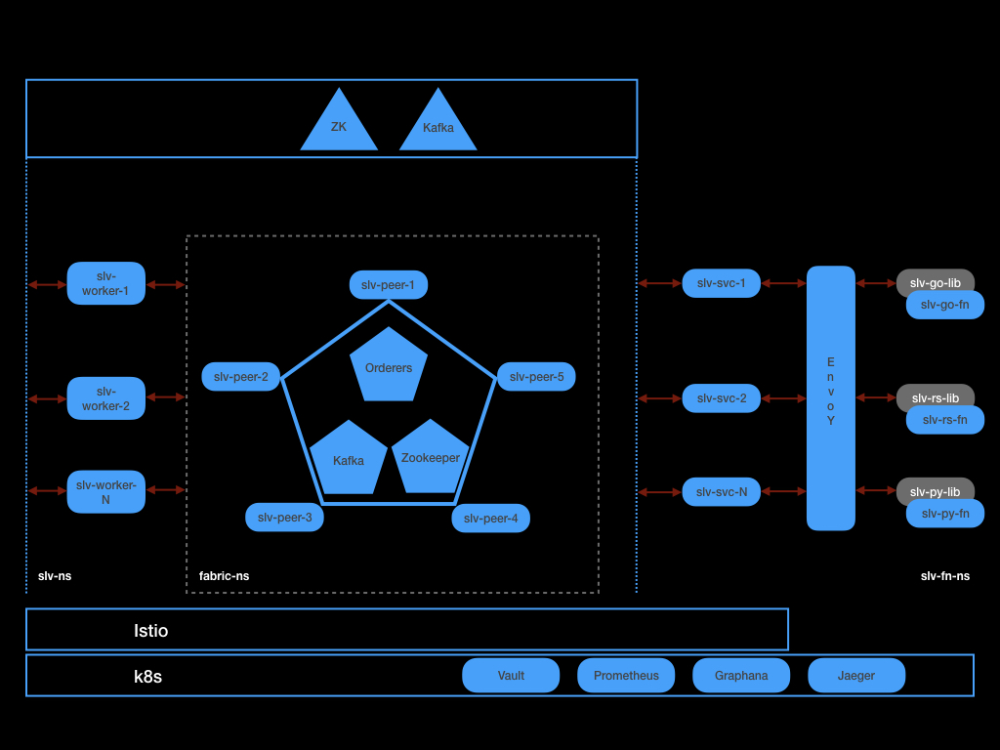

# slv-hlf-chaincodes

### Goals
- Provide a reliable set of Hyperledger Fabric Chaincodes for the slv-worker service.

### Overview

This repository contains all the Hyperledger Fabric Chaincodes needed for the slv-worker service to realise user requests.

### Overview of Serverless Ledger Variables (SLV)

SLV provides a way for serverless functions to create and manage state. In addition to the usual properties such Type, Scope, Permissions; SLV provides -

- All writes to the state are performed when the Blockchain consensus is achieved.
- History of all changes to the state can be queried.

